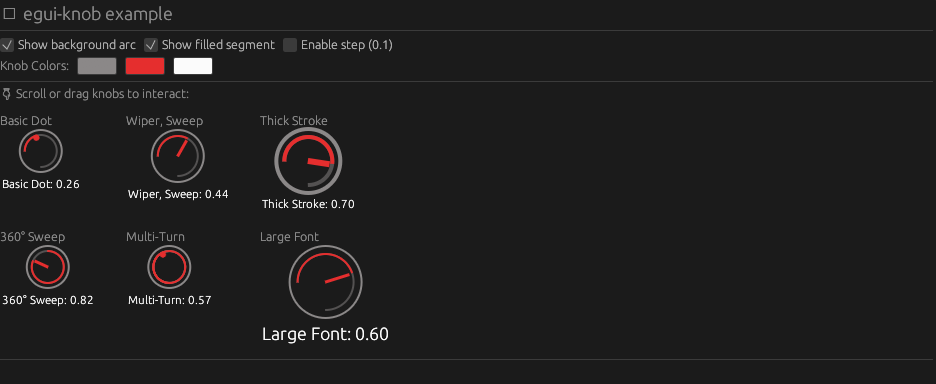

# egui_knob


Simple knob widget for egui.



## Features

- Adjustable size, font size, and stroke width.
- Customizable colors for the knob, indicator and text.
- Label positions (Top, Bottom, Left, Right).
- Label formatting.
- Two styles: Wiper and Dot.

## Installation

To use the Knob widget in your project, add the following to your `Cargo.toml`:

```toml
[dependencies]
egui = "0.32"
egui_knob = "0.3.1"
```

## Usage example

```rust
use egui::{Color32, Context};
use egui_knob::Knob;

// ..

let mut value: f32 = 0.5;
let knob = Knob::new(&mut value, 0.0, 1.0, KnobStyle::Wiper)
    .with_size(50.0)
    .with_font_size(14.0)
    .with_stroke_width(3.0)
    .with_colors(Color32::GRAY, Color32::WHITE, Color32::WHITE)
    .with_label("Volume", LabelPosition::Top);

egui::CentralPanel::default().show(ctx, |ui| {
    ui.add(knob);
});
```
